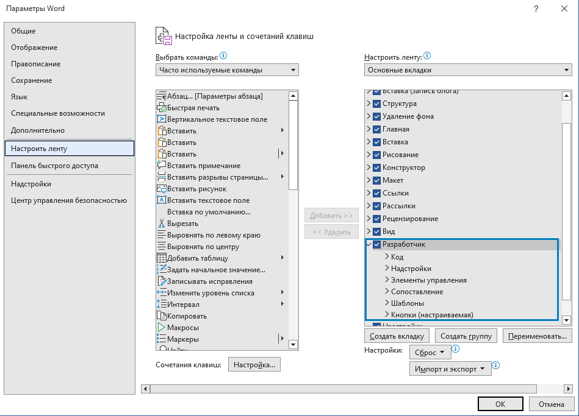
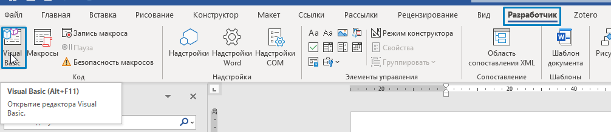
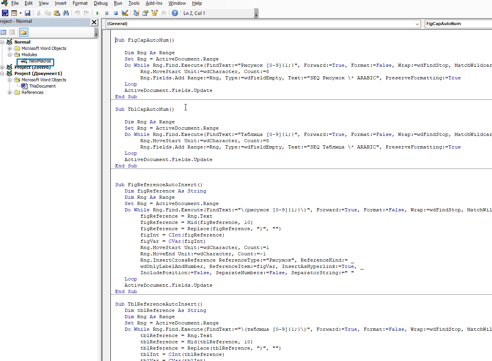
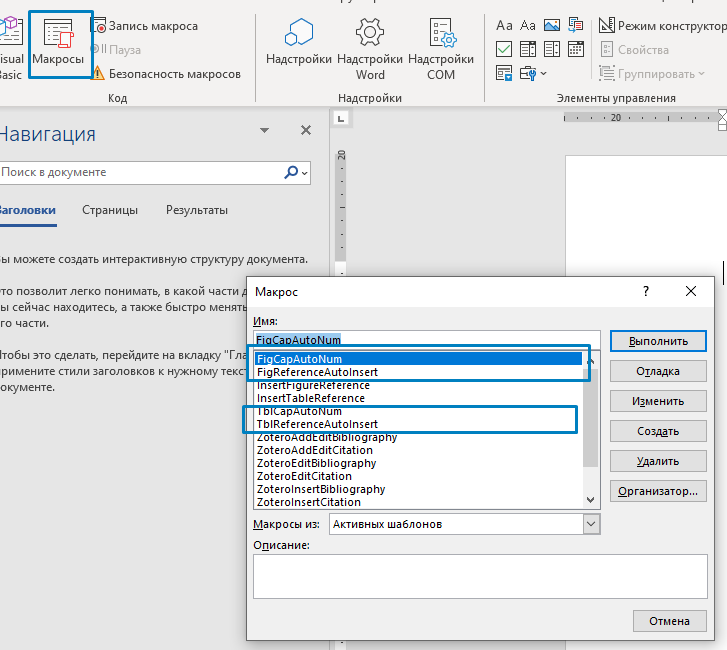

## Сборка документа

Время магии!

### Запуск скрипта

Документ собирается командным файлом .bat. Вот так он примерно выглядит внутри:

```console
powershell.exe -command .\build.ps1 ^
-md demo-report-beginning.md,demo-main.md,demo-report-end.md ^
-template template-report.docx ^
-pdf report.pdf ^
-docx report.docx ^
-embedfonts ^
-counters
pause
```

Параметры:

- `-md` -- список файлов через запятую, содержимое которых будет записано в результирующий файл. Они будут обрабатываться именно в том порядке, в котором здесь указаны. Можно указывать относительный путь, например вот так: `.\subfolder\examples.md`;
- `-template` -- файл docx, который будет использован в качестве шаблона
- `-pdf` -- название результирующего pdf файла. Если pdf не нужен (он долго выводится достаточно), то просто уберите эту строчку
- `-docx` -- название результирующего docx файла. Будет перезаписан, если существует
- `-embedfonts` -- включать ли шрифты в файл. Если включать, то файл получиться большим (от 4 МБ), если включать не нужно - то удалите эту строчку
- `-counters` -- счетчики - эта опция считает количество рисунков, таблиц, секций и нумерует все соответственно
- `pause` -- это просто чтобы окошко не исчезало сразу, и можно было ошибки посмотреть.
Опция `-md` может получиться очень длинной, так что внимательно.

Для сборки документов запустите отредактированный .bat файл, и рядом с .bat появятся (или перезапишутся) собранные готовые файлы.

### Предобработка

Как вы помните, в нашей структуре файлов в каждой папке с .md есть папка `_img`, в которой хранятся картинки. В тексте .md ссылки на картинки - относительные, вида `(_img/file.png)`. Скрипту build.ps1 нужно, чтобы все картинки размещались относительно его самого, а не относительно файла .md. Простейший способ решить эту проблему -- скопировать все картинки из дочерних `_img` в корневую относительно `build.ps1`. Для этого написан простенький скрипт на python, который:

1. Получает все картинки `.jpg`, `.png`, `.bmp` (можете добавить в скрипт свои форматы и расширения).
2. Сохраняет список картинок в `copied_files.json`. Если встретились картинки с одинаковыми названиями, перезаписывать не будет, так что все картинки должны быть с разными названиями.
3. Копирует картинки в корневую папку.
4. (Опционально) после сборки можно вызвать скрипт с флагом `-r`, чтобы удалить копии картинок из корневой `_img` (чтобы не было дублирования).

Вызов скрипта можно добавить прямо в `build-docs.bat`:

```console
@echo off
"C:\Python\Python310\python.exe" %~dp0\..\scripts_and_macros\copy_img.py -s "..\docs_gost" -d "..\docs_gost\_img" -c
@echo on

powershell.exe -command .\build.ps1 ^
-md .\report-beginning.md,.\01_setup\01_what_is_happening.md,.\01_setup\02_install.md,.\02_md_to_docx\01_folder_structure.md,.\02_md_to_docx\02_gd_examples.md,.\02_md_to_docx\03_build_doc_macro_final.md,.\03_md_to_web\01_build_web.md,.\03_md_to_web\02_remove_gd_tags.md,.\03_md_to_web\03_all_together.md,.\03_md_to_web\04_useful_plugins.md,.\03_md_to_web\05_pdf_thoughts.md,.\04_vscode_settings\01_setup_workspace.md,.\04_vscode_settings\02_tasks_snippets.md,.\report-end.md ^
-template template-report.docx ^
-pdf report.pdf ^
-docx report.docx ^
-embedfonts ^
-counters

@echo off
"C:\Python\Python310\python.exe" %~dp0\..\scripts_and_macros\copy_img.py -r
@echo on
```

### Постобработка

Хотя собранный документ по замыслу можно использовать прям как есть, все же требуется еще пара штрихов:

1. Автонумерация для рисунков и таблиц.
2. Перекрестные ссылки на нумерованные таблицы и рисунки.

Gostdown не использует в финальном файле автоматическую нумерацию, а вместо этого делает закладки и гиперссылки. Проблема тут в том, что если нужно отредактировать финальный файл или отдать его Заказчику для вставки в другой документ, то нумерация таблиц и рисунков поломается. 

Для автоматической нумерации разработаны макросы, которые нужно добавить в шаблон Normal.dot.

Алгоритм макроса на автоматическую нумерацию:

1. Ищем в документе все `Рисунок [0-9]{1;}` и `Таблица [0-9]{1;}` (учитывается регистр), выделяем.
2. Заменяем на автоматическую нумерацию. 

Аналогичного эффекта также можно добиться Поиском и заменой, если не хочется использовать макрос:

1. Вставить название рисунка или таблицы (с автонумерацией).
2. Правый клик по полю > Коды/значения полей (чтобы включить полное отображение поля).
3. Выделить «Название» с полем и Ctrl + C.
4. Вызывать диалог Find/Replace.
5. Отметить галку «Подстановочные знаки».
6. В поле «Найти» вставить: `Рисунок [0-9]{1;}` или (`Рисунок ([0-9]{1;})` для группы), ну и Таблица для таблиц.
7. В поле «Заменить» Специальный > содержимое буфера обмена (или ^c).
8. Заменить все.
9. Обновить поля.

Код макроса:

```vb
Sub FigCapAutoNum()

   Dim Rng As Range

   Set Rng = ActiveDocument.Range

   Do While Rng.Find.Execute(FindText:="Рисунок [0-9]{1;}", Forward:=True, Format:=False, Wrap:=wdFindStop, MatchWildcards:=True, MatchCase:=True) = True
        Rng.MoveStart Unit:=wdCharacter, Count:=8
        Rng.Fields.Add Range:=Rng, Type:=wdFieldEmpty, Text:="SEQ Рисунок \* ARABIC", PreserveFormatting:=True
   Loop

   ActiveDocument.Fields.Update
End Sub

Sub TblCapAutoNum()

   Dim Rng As Range

   Set Rng = ActiveDocument.Range

   Do While Rng.Find.Execute(FindText:="Таблица [0-9]{1;}", Forward:=True, Format:=False, Wrap:=wdFindStop, MatchWildcards:=True, MatchCase:=True) = True
        Rng.MoveStart Unit:=wdCharacter, Count:=8
        Rng.Fields.Add Range:=Rng, Type:=wdFieldEmpty, Text:="SEQ Таблица \* ARABIC", PreserveFormatting:=True
   Loop

   ActiveDocument.Fields.Update
End Sub
```

А вот с перекрестными ссылками так просто поиском и заменой уже не получится, поэтому только макрос. В макросе захардкожены ссылки на рисунки вида `(рисунок N)` с учетом регистра, т.е. в тексте это выглядит как `на рисунке ниже (рисунок N)`. Алгоритм макроса:

1. Удаляем гиперссылки с текстом, содержащим `fig:` и `tbl:`.
2. Находим все `(рисунок N)`/`(таблица N`).
3. Обрезаем скобки.
4. Обрезаем номер рисунка/таблицы.
5. Заменяем текст на перекрестную ссылку функцией InsertCrossReference с номером, который выдрали на шаге 4.

Код макроса (убедитесь, что при вставке в Word VBA не побилась кодировка):

```vb
Sub FigReferenceAutoInsert()
   Dim figReference As String
   
   Dim oField As Field
   For Each oField In ActiveDocument.Fields
    If oField.Type = wdFieldHyperlink Then
      If Mid(oField.Code, 16, 4) = "fig:" Then
        oField.Unlink
      End If
    End If
   Next
   Set oField = Nothing
   
   Dim Rng As Range
   Set Rng = ActiveDocument.Range
   Do While Rng.Find.Execute(FindText:="\(рисунок [0-9]{1;}\)", Forward:=True, Format:=False, Wrap:=wdFindStop, MatchWildcards:=True, MatchCase:=True) = True
        figReference = Rng.Text
        figReference = Mid(figReference, 10)
        figReference = Replace(figReference, ")", "")
        figInt = CInt(figReference)
        figVar = CVar(figInt)
        Rng.MoveStart Unit:=wdCharacter, Count:=1
        Rng.MoveEnd Unit:=wdCharacter, Count:=-1
        Rng.InsertCrossReference ReferenceType:="Рисунок", ReferenceKind:= _
        wdOnlyLabelAndNumber, ReferenceItem:=figVar, InsertAsHyperlink:=True, _
        IncludePosition:=False, SeparateNumbers:=False, SeparatorString:=" "
   Loop
   ActiveDocument.Fields.Update
End Sub

Sub TblReferenceAutoInsert()
   Dim tblReference As String
   
   Dim oField As Field
   For Each oField In ActiveDocument.Fields
    If oField.Type = wdFieldHyperlink Then
      If Mid(oField.Code, 16, 4) = "tbl:" Then
        oField.Unlink
      End If
    End If
   Next
   Set oField = Nothing
  
   Dim Rng As Range
   Set Rng = ActiveDocument.Range
   Do While Rng.Find.Execute(FindText:="\(таблица [0-9]{1;}\)", Forward:=True, Format:=False, Wrap:=wdFindStop, MatchWildcards:=True, MatchCase:=True) = True
        tblReference = Rng.Text
        tblReference = Mid(tblReference, 10)
        tblReference = Replace(tblReference, ")", "")
        tblInt = CInt(tblReference)
        tblVar = CVar(tblInt)
        Rng.MoveStart Unit:=wdCharacter, Count:=1
        Rng.MoveEnd Unit:=wdCharacter, Count:=-1
        Rng.InsertCrossReference ReferenceType:="Таблица", ReferenceKind:= _
        wdOnlyLabelAndNumber, ReferenceItem:=tblVar, InsertAsHyperlink:=True, _
        IncludePosition:=False, SeparateNumbers:=False, SeparatorString:=" "
   Loop
   ActiveDocument.Fields.Update
End Sub
```

Чтобы использовать этот код, необходимо в Microsoft Word активировать панель разработчика (рисунок [-@fig:md_docx_devpanel]), вызвать лист VBA (рисунок [-@fig:md_docx_vbsheet]) и вставить код (рисунок [-@fig:md_docx_vbsheet_macro]). 

{#fig:md_docx_devpanel}

{#fig:md_docx_vbsheet}

{#fig:md_docx_vbsheet_macro}

А затем запустить макрос (рисунок [-@fig:md_docx_macros]).

{#fig:md_docx_macros}

Вот теперь у нас действительно классный docx.
