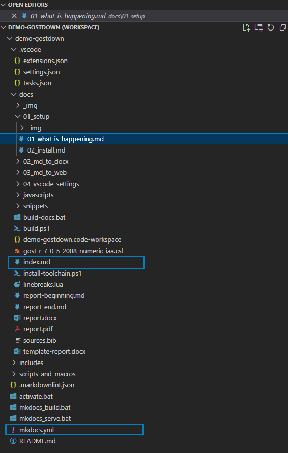

# Собираем веб-доку

## Превью и html

Сборка выполняется 🌐[mkdocs-material](https://squidfunk.github.io/mkdocs-material/getting-started/), и по ссылке можно найти очень подробную документацию как сделать что угодно. Кроме того, mkdocs поддерживает огромное количество всяких плагинов, так что если что-то надо сделать необычное -- скорее всего на это уже есть плагин. Кроме того, из mkdocs можно собирать PDF, хотя пока что мне это не пригодилось, поэтому инструкции не будет).

У Mkdocs есть требования к структуре (рисунок [-@fig:mkdocs_structure]):

- должна быть папка `/docs`, в которой все лежит;
- в папке `/docs` должен быть `index.md` файл;
- файлы .bib и .csl для источников также должны быть расположены относительно mkdocs.yml.

{#fig:mkdocs_structure}

В конфигурационном файле `mkdocs.yml` описана структура и плагины. 
В основном нужно редактировать четыре верхние строки (для нового проекта) и раздел `nav`.
В разделе `nav` указаны пункты левого меню и файлы md, которые будут рендерится, когда перейдешь в это меню.
Включите в своем редакторе отображение пробелов, так как `yml` очень капризен к отступам.

Собираем документ. В директории, где лежит mkdocs yml выполнить команду: `mkdocs serve`.
Эта команда запустит маленький веб-сервер на 127.0.0.1:8000 и будет показывать наш сайт с докой.
Если нужно собрать html из доки, нужно выполнить команду: `mkdoc build`.
