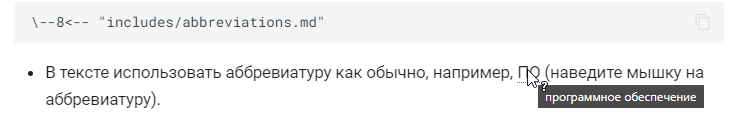
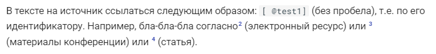
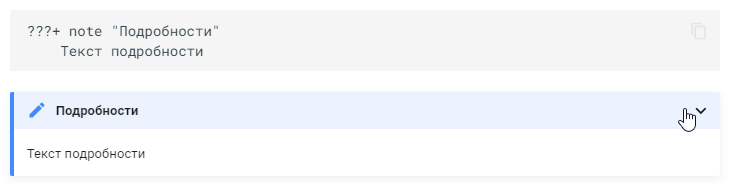
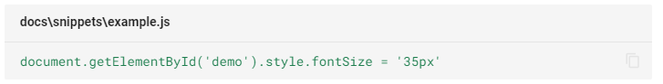
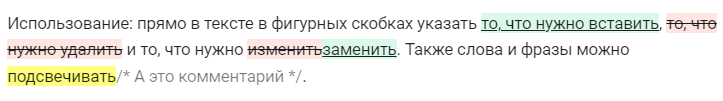
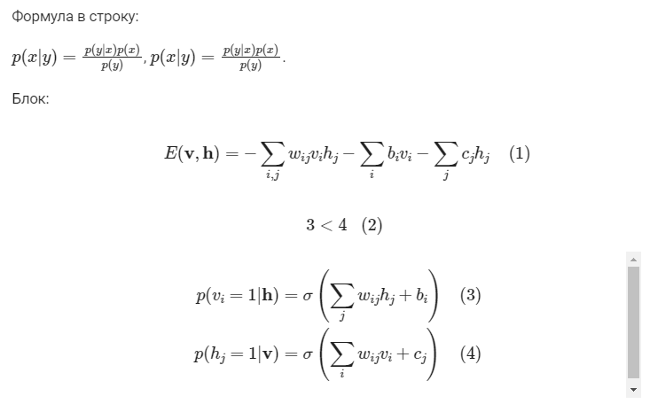

## Полезные плагины и расширения

Все примеры ниже будут красиво отображаться при просмотре документации в mkdocs.

### Аббревиатуры

Расширение: [Abbreviations](https://squidfunk.github.io/mkdocs-material/setup/extensions/python-markdown/#abbreviations).

Установка: добавить в список `markdown_extensions` ключ `-abbr`:

```yaml
markdown_extensions:
  - abbr
```

Использование:

- Создать файл с аббревиатурами, например, `includes/abbreviations.md` вида:
   
```markdown
*[ДИВ]: деструктивное информационное воздействие
*[ПО]: программное обеспечение
*[СЗИ]: средство защиты информации
*[ДМЗ]: демилитаризованная зона
```

- В файле .md, к котором нужно использовать аббревиатуры, добавить в конце строку (без бэкслеша в начале строки):

```text
\--8<-- "includes/abbreviations.md"
```

- В тексте использовать аббревиатуру как обычно, например, ПО (наведите мышку на аббревиатуру).

А на рисунке ниже (рисунок [-@fig:mkd_plg_abbr]) пример, как это выглядит в веб-документации.

{#fig:mkd_plg_abbr}

Кстати, если при запуске стриппера добавить аргумент `-a`, то он добавит в конец каждого файла ссылку на файл с аббревиатурами.

### Источники

Плагин: [mkdocs-bibtex](https://pypi.org/project/mkdocs-bibtex/).

Установка:

- Установить [pandoc](https://pandoc.org/installing.html).
- Выполнить команду:
  
```console
pip install mkdocs-bibtex
```

Добавить плагин в список `plugins`:

```yaml linenums="1" hl_lines="3 4"
plugins:
  - bibtex:
      bib_file: "sources.bib"
      csl_file: "gost-r-7-0-5-2008-numeric-iaa.csl"
```

где `bibtex` - название плагина, `bib_file` - путь к файлу с источниками, `csl_file` - ссылка на файл со стилями. 

В тексте на источник ссылаться следующим образом: `[ @test1]` (без пробела), т.е. по его идентификатору. Например, бла-бла-бла согласно[@test1] (электронный ресурс) или [@jia2014caffe] (материалы конференции) или [@ren2015faster] (статья).

Пример в тексте на рисунке ниже (рисунок [-@fig:mkd_plg_sources]).

{#fig:mkd_plg_sources}

### Сноски

Расширение: [Footnotes](https://squidfunk.github.io/mkdocs-material/setup/extensions/python-markdown/#footnotes)

Установка: добавить в список `markdown_extensions` ключ `-footnotes`:

```yaml
markdown_extensions:
  - footnotes
```

Использование: в тексте (например, в конце) указать сноску в формате:
  
```text
[^f1]: Lorem ipsum dolor sit amet, consectetur adipiscing elit.
```

В тексте указать ссылку inline[^f1]. При использовании одновременно с bibtex и сноски, и источники будут отображены в порядке появления в тексте: сначала все сноски, потом все источники.

[^f1]: Lorem ipsum dolor sit amet, consectetur adipiscing elit.

### Спойлер

Расширение: [Details](https://facelessuser.github.io/pymdown-extensions/extensions/details/).  

Что делает: collapsable элементы.

Установка: добавить в список `markdown_extensions` ключ `-pymdownx.details`.

Пример:

```text
???+ note "Подробности"
    Текст подробности
```

???+ note "Подробности"
    Текст подробности

Пример того, как это выглядит в тексте в веб-документации, приведен ниже (рисунок [-@fig:mkd_plg_spoiler]).

{#fig:mkd_plg_spoiler}
    
### Сниппеты

Расширение: [Snippets](https://facelessuser.github.io/pymdown-extensions/extensions/snippets/).  

Что делает: позволяет вставлять код из файла.

Установка: добавить в список `markdown_extensions` ключ `-pymdownx.snippets`.

Использование:

```yaml title="docs\snippets\example.js"
--8<-- "docs\snippets\example.js"
```

Пример на рисунке ниже (рисунок [-@fig:mkd_plg_snippet]).

{#fig:mkd_plg_snippet}

### Критик

Расширение: [pymdownx.critic](https://facelessuser.github.io/pymdown-extensions/extensions/critic/).  
Что делает: позволяет в тексте проводить рецензирование.

Установка: добавить в список `markdown_extensions` ключ `-pymdownx.critic`.

Использование: прямо в тексте в фигурных скобках указать {++то, что нужно вставить++}, {--то, что нужно удалить--} и то, что нужно {~~изменить~>заменить~~}. Также слова и фразы можно {==подсвечивать==}{>>А это комментарий<<}.

Вид можно настраивать ключом `- mode` для плагина. Доступные значения:

- `view` - подсветит все рецензии;
- `accept` - отобразит только добавленные и замененные, удалит удаленные изменения;
- `reject` - покажет текст без предложенных изменений.

Пример в тексте на рисунке ниже (рисунок [-@fig:mkd_plg_critic]).

{#fig:mkd_plg_critic}

### Формулы

Расширение: [Arithmatex](https://facelessuser.github.io/pymdown-extensions/extensions/arithmatex/). Много вариантов рендеринга формул. Здесь описан только один из возможных.

Установка: добавить в список `markdown_extensions` ключ `- pymdownx.arithmatex`.

Формула в строку:

$p(x|y) = \frac{p(y|x)p(x)}{p(y)}$, \(p(x|y) = \frac{p(y|x)p(x)}{p(y)}\).

Блок:

$$
E(\mathbf{v}, \mathbf{h}) = -\sum_{i,j}w_{ij}v_i h_j - \sum_i b_i v_i - \sum_j c_j h_j
$$

\[3 < 4\]

\begin{align}
    p(v_i=1|\mathbf{h}) & = \sigma\left(\sum_j w_{ij}h_j + b_i\right) \\
    p(h_j=1|\mathbf{v}) & = \sigma\left(\sum_i w_{ij}v_i + c_j\right)
\end{align}

Пример, как это выглядит в веб-документации, на рисунке ниже (рисунок [-@fig:mkd_plg_eq]).

{#fig:mkd_plg_eq}
