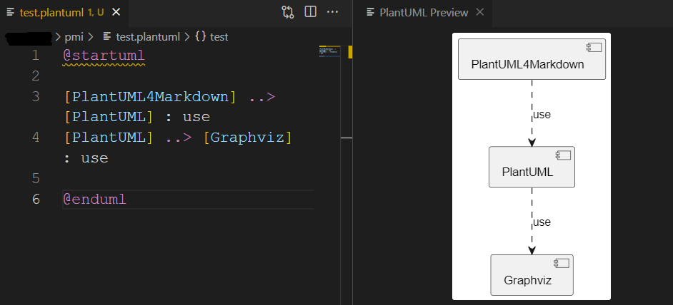

# VScode to rule them all

Основной редактор, в котором я творю все вышеописанные безобразия, -- VSCode. Интеграция с гитом из коробки, спеллчекинг (ну хоть какой-то), удобные линтер-плагины, рендеринг на лету и прочая красота.

Демо-репозиторий предоставляется с готовым файлов .workspace. Просто откройте его в VSCode (File > Open Workspace from File ...) и часть настроек подхватится.

## Расширения

Расширения VSCode для работы с текстом:

- [Code Spell Checker](https://marketplace.visualstudio.com/items?itemName=streetsidesoftware.code-spell-checker) -- проверяет орфографические ошибки. Я рекомендую добавлять неизвестные слова в Workspace Settings (ПКМ по слову и дальше разберетесь). Settings хранятся в корне директории в файле `.code-workspace`.
- [Russian Code Spell Checker](https://marketplace.visualstudio.com/items?itemName=streetsidesoftware.code-spell-checker-russian) -- дополнение проверки с русским языком.
- [Live Preview](https://marketplace.visualstudio.com/items?itemName=ms-vscode.live-server)- рендерит markdown прямо в редакторе, для быстрого просмотра «печатного» вида файла.
- [Markdown all in one](https://marketplace.visualstudio.com/items?itemName=yzhang.markdown-all-in-one) -- это набор инструментов для работы с markdown.
- [Markdown Table](https://marketplace.visualstudio.com/items?itemName=TakumiI.markdowntable) -- использую отсюда одну единственную функцию -- ПКМ по пустому месту в файле с таблицами > Format All Tables.
- [markdownlint](https://marketplace.visualstudio.com/items?itemName=DavidAnson.vscode-markdownlint) -- это помощник по синтаксису markdown, чтобы все было красиво. Некоторые правила можно отключать. В корне проекта обычно лежит файл `..markdownlint.json`, в котором перечислены правила, которые отключены. Чтобы узнать номер правила, наведите курсор на проблему -- в появившемся тултипе будет написано.
- [Todo Tree](https://marketplace.visualstudio.com/items?itemName=Gruntfuggly.todo-tree) -- удобный плагин для отслеживания `#todo` по всем файлам. В тексте просто пишете `#TODO надо слепить снеговика` и потом по всем файлам в панели Todo можно их просматривать. Режим отображения todo можно переключать (все todo списком, по файлам...). Пример на рисунке ниже (рисунок [-@fig:vscode_todo]).

{#fig:vscode_todo}

В корне репозитория есть папка `.vscode` ее я тоже загружаю в репозиторий. Там в том числе хранится файл extensions.json, в котором все нужные расширения перечислены -- их можно будет найти легко в магазине расширений (они будут прямо вверху списка). Вот как это будет выглядеть (рисунок [-@fig:vscode_extensions]).

{#fig:vscode_extensions}

Кстати, если вам нравится рисовать схемы в PlantUML, то можете еще установить и PlantUML расширение, тогда вы сможете прямо в VScode их рендерить (рисунок [-@fig:vscode_plantuml]).

{#fig:vscode_plantuml}

## Сниппеты

Сниппеты можно использовать для быстрой вставки кода. Я использую их для вставки gostdown элементов и кавычек-ёлочек. Как делать сниппеты достаточно подробно описано вот здесь: https://code.visualstudio.com/docs/editor/userdefinedsnippets. Все сниппеты хранятся в пользовательской директории `%appdata%\Code\User\snippets\` в файле с названием языка, например `markdown.json`.

Например, вставим сниппет для добавления названия таблиц:

```json
{   
    "Table": {
        "prefix": [
            "#tbl"
        ],
        "body": [
            "Table: Имя таблицы {#tbl:table_name}"
        ],
        "description": "Table reference"
    },
}
```

Теперь в тексте, под таблицей начинаем писать `#t...` и выбираем в появившейся подсказке `#tbl`. Автоматически будет вставлен шаблон подписи таблицы по Gostdown (рисунок [-@fig:vscode_insert_tab_caption]).

{#fig:vscode_insert_tab_caption}

Также в сниппетах можно использовать текст из буфера обмена (`${CLIPBOARD}`) и выделенный текст (`$TM_SELECTED_TEXT`). Например, можно выделить название рисунка из ссылки, скопировать, установить курсор в нужное место и вызвать сниппеты `#fig_cap` и `#fig_ref` (для ссылки на рисунок), см. пример на рисунке ниже (рисунок [-@fig:vscode_insert_fig_caption]).

{#fig:vscode_insert_fig_caption}

Также можно вставлять разные символы, например, кавычки-ёлочки. Вот сниппет для кавычек:

```json
"French Quotes": {
        "prefix": [
            "<qu"
        ],
        "body": [
            "«$TM_SELECTED_TEXT»"
        ]
    }
```

Так как каждый раз вызывать сниппет довольно долго, вместо этого привяжем его к горячей клавише. Для этого:

1. Открыть редактор горячих клавиш (File > Preferences > Keyboard Shortcuts).
2. В правом верхнем углу нажмите кнопку _Open Keyboard Shortcuts (JSON)_. Откроется файл с вашими горячими клавишами (рисунок [-@fig:vscode_keybindings]).

{#fig:vscode_keybindings}

Вставить код следующего вида:

```json
[
    {
        "key": "ctrl+shift+q",
        "command": "editor.action.insertSnippet",
        "when": "editorTextFocus",
        "args": {
            "langId": "markdown",
            "name": "French Quotes"
        }
    }
]
```

Теперь в тексте нужно выделить текст, который хотим заключить в кавычки, и нажать `Ctrl` + `Shift` + `Q`. 
